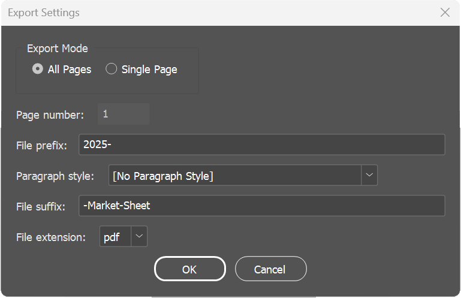

# InDesign Data Merge Exporter Script

A script for Adobe InDesign that enables automated export of Data Merge-generated pages with custom naming based on page content. Perfect for creating market sheets, catalogs, or any document where you need individual pages exported with names derived from their content.

## Features

- Export all pages or a single page
- Custom file naming based on page content
- Support for PDF, JPG, and PNG exports
- Uses InDesign's native file dialog
- Smart handling of special characters in filenames
- Progress bar for long exports
- Cloud storage friendly

## Installation

1. Open InDesign
2. Go to Window > Utilities > Scripts
3. Right-click on the "User" folder in the Scripts panel
4. Choose "Reveal in Explorer" (Windows) or "Reveal in Finder" (Mac)
5. Copy `indesign-market-export.jsx` to this folder
6. The script will now appear in your Scripts panel under "User"

## Usage

1. Create your Data Merge document in InDesign
2. Ensure the text you want to use for filenames has a consistent paragraph style
3. Run the script from Window > Utilities > Scripts > User > indesign-market-export
4. In the dialog that appears:
   - Choose between exporting all pages or a single page
   - Enter the page number (if exporting a single page)
   - Set your file prefix (e.g., "2025-")
   - Select the paragraph style containing your naming text
   - Set your file suffix (e.g., "-Market-Sheet")
   - Choose your file format (PDF/JPG/PNG)
5. Choose your export location
6. Let the script process your exports

## Example

If you have a document with school names in the "SchoolName" paragraph style:
- Input text: "California State University – Chico"
- Prefix: "2025-"
- Suffix: "-Market-Sheet"
- Format: PDF
- Result: "2025-California-State-University-Chico-Market-Sheet.pdf"

## Requirements

- Adobe InDesign CC or later
- A document with consistent paragraph styles
- Write permissions in the export location

## Known Limitations

- Maximum filename length of 200 characters (excluding prefix/suffix)
- Requires paragraph styles to identify naming text
- Export presets are currently fixed (High Quality)

## Troubleshooting

If you encounter issues:
1. Ensure your document is saved before running the script
2. Verify the paragraph style exists and is applied correctly
3. Check write permissions in your export location
4. For cloud storage issues, try exporting to a local folder first

## Contributing

Feel free to submit issues and enhancement requests! When contributing to this repository, please first discuss the change you wish to make via issue or email.

## License

This script is released under the MIT License. See the LICENSE file for details.

## Version History

- 1.0.0 (2025-02-03)
  - Initial release
  - Support for PDF/JPG/PNG exports
  - Smart filename handling
  - Progress bar implementation

## Credits

Developed by Kade O'Connor for CollegiateParent, LLC with assistance from Anthropic Claude AI

## Support

For support, please open an issue on GitHub at github.com/kadeocon or contact kocon.dev@pm.me.

---

**Note**: Always test the script on a backup copy of your document first.
